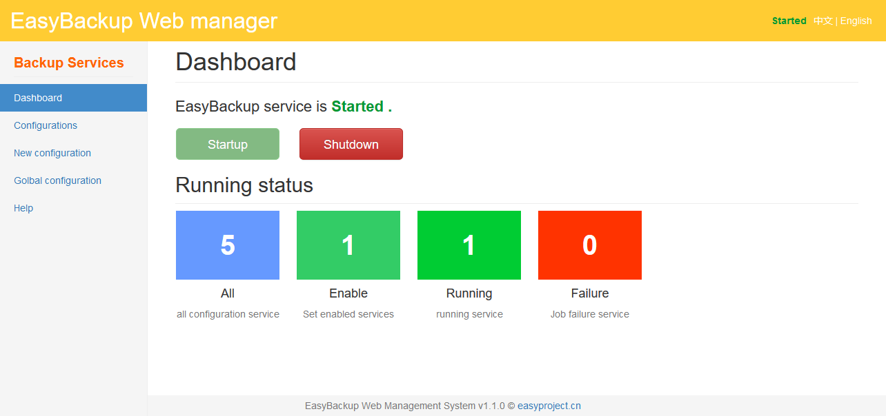
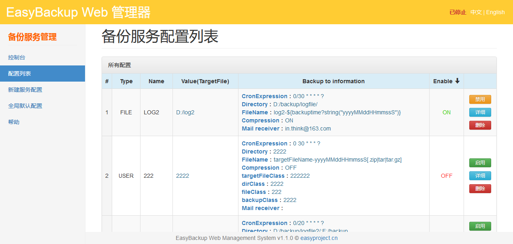
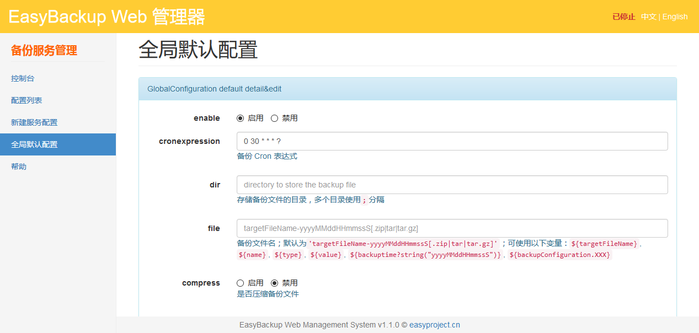
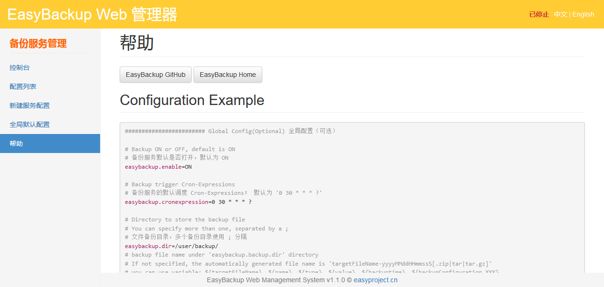

# EasyBackup Web Manger

EasyBackup Web Manger is a Java Web Manager based on the  [EasyBackup framework Engine](https://github.com/ushelp/EasyBackup "移步 EasyBackup"), you can complete the backup configuration, start and stop control.

To use, please learning  [EasyBackup](https://github.com/ushelp/EasyBackup "Goto EasyBackup")。

## Use

1. Make backup-web.war deployed to a Web container (Tomcat, Jetty ...)

2. Visit http://127.0.0.1:8888/easybackup-web/

## Features

### Dashboard
Start, stop, monitor backup service running.

### Configuration list
Backup configuration list of services; view, edit, delete, enable, disable service items. 

### New Backup Service Configuration
Add a new backup service configuration.

### The global default configuration
The default global configuration backup service configuration.

### Help
Configuration examples.

## Project configuration information

### EasyBackup profiles
**Reminder**: If necessary, please note the following core backup configuration files to prevent accidental deletion operation and maintenance of the backup configuration you create.

- Backup core profile `/easybackup.properties` 
- Send e-mail template directory `/template/`

### EasyBackup Web I18N profiles

- I18N configuration `/WEB-INF/classes/easybackup_lang_country.properties`

## End

Email：<inthinkcolor@gmail.com>

[http://www.easyproject.cn](http://www.easyproject.cn "EasyProject Home")

**Donation/捐助:**

<a href="http://www.easyproject.cn/donation">
</img></a>

支付宝/微信/QQ/云闪付/PayPal

 

我们相信，每个人的点滴贡献，都将是推动产生更多、更好免费开源产品的一大步。

**感谢慷慨捐助，以支持服务器运行和鼓励更多社区成员。**

We believe that the contribution of each bit by bit, will be driven to produce more and better free and open source products a big step.

**Thank you donation to support the server running and encourage more community members.**
