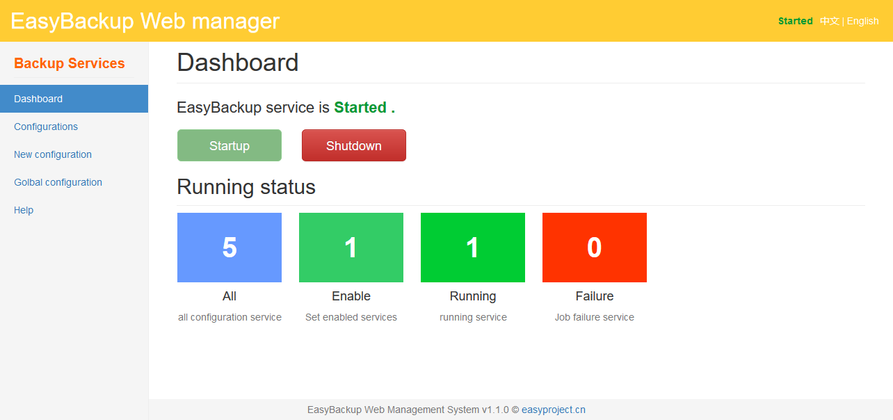

# EasyBackup Web Manger

EasyBackup Web Manger 是一个基于 [EasyBackup 框架引擎](https://github.com/ushelp/EasyBackup "移步 EasyBackup") 的 Java Web 管理器，可以在 Web UI 下完成备份配置管理，备份启动，停止控制。

如需使用，请先了解 [EasyBackup](https://github.com/ushelp/EasyBackup "移步 EasyBackup")。

EasyBackup Web Manger is a Java Web Manager based on the  [EasyBackup framework Engine](https://github.com/ushelp/EasyBackup "移步 EasyBackup"), you can complete the backup configuration, start and stop control.

To use, please learning  [EasyBackup](https://github.com/ushelp/EasyBackup "Goto EasyBackup")。

## 中文

**EasyBackup-Web 最新版本**： `1.2.0`

**EasyBackup 版本和插件**：
- `easybackup-3.3.2-RELEASE.jar` 
- `easybackup-mysql-plugin-3.2.0-RELEASE.jar`  MySQL 数据库备份插件

[中文说明文档](doc/readme_zh_CN.md)

[官方主页](http://www.easyproject.cn/easybackup/zh-cn/index.jsp '官方主页')

[留言评论](http://www.easyproject.cn/easybackup/zh-cn/index.jsp#donation '留言评论')

如果您有更好意见，建议或想法，请联系我。

## English

**EasyBackup-Web latest version**: `1.2.0`

**EasyBackup version&plugins**: 
- `easybackup-3.3.2-RELEASE.jar` 
- `easybackup-mysql-plugin-3.2.0-RELEASE.jar`  MySQL Databasse Backup plugin

[English Readme](doc/readme_en.md)

[The official home page](http://www.easyproject.cn/easybackup/en/index.jsp 'The official home page')

[Comments](http://www.easyproject.cn/easybackup/en/index.jsp#donation 'Comments')

If you have more comments, suggestions or ideas, please contact me.

## End

Email：<inthinkcolor@gmail.com>

[http://www.easyproject.cn](http://www.easyproject.cn "EasyProject Home")

**Donation/捐助:**

<a href="http://www.easyproject.cn/donation">
</img></a>

支付宝/微信/QQ/云闪付/PayPal

 

我们相信，每个人的点滴贡献，都将是推动产生更多、更好免费开源产品的一大步。

**感谢慷慨捐助，以支持服务器运行和鼓励更多社区成员。**

We believe that the contribution of each bit by bit, will be driven to produce more and better free and open source products a big step.

**Thank you donation to support the server running and encourage more community members.**
